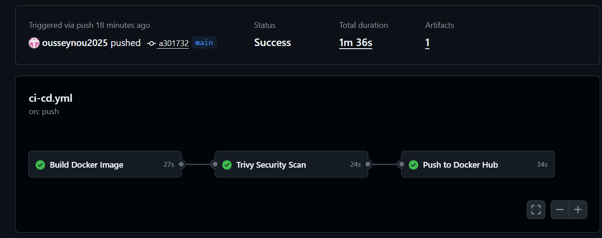
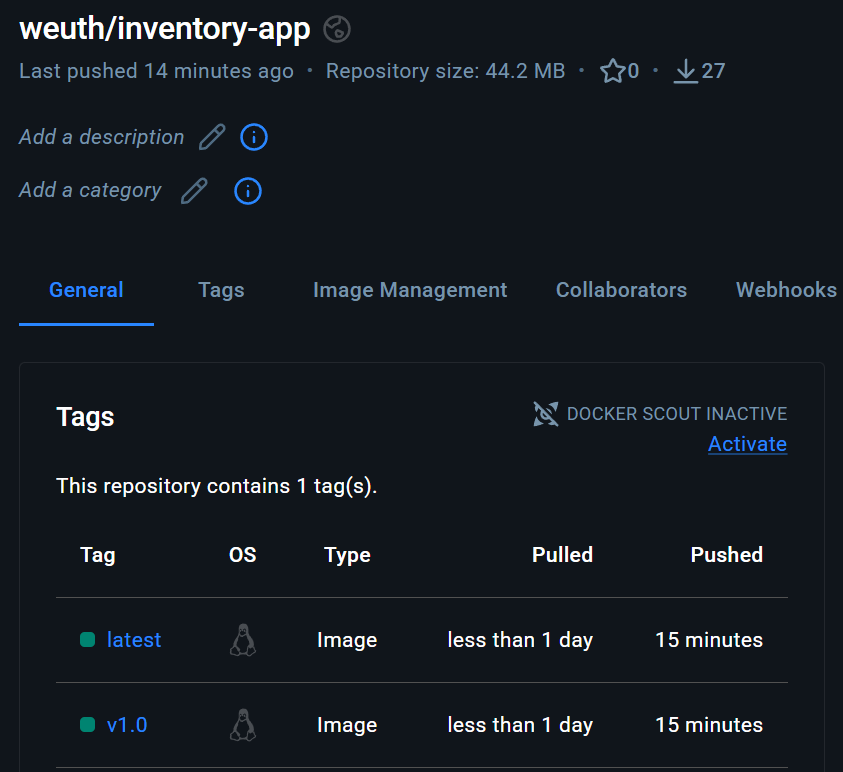
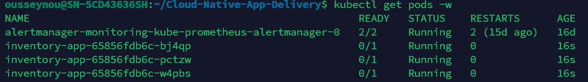
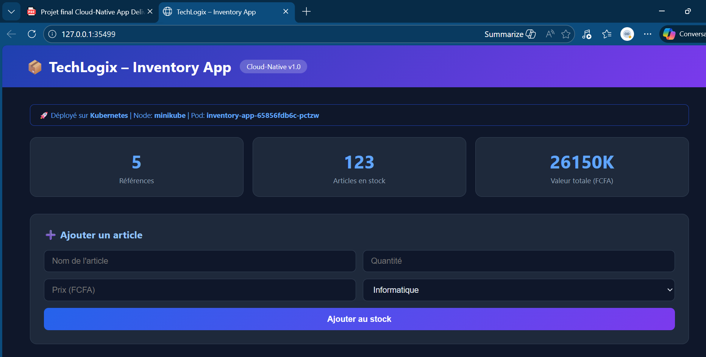

# Cloud-Native App Delivery — TechLogix Inventory App

TP Final | Cloud-Native App Delivery | Deadline : 12 mars 2026

---

## Depot GitHub

https://github.com/ousseynou2025/Cloud-Native-App-Delivery

---

## Structure du projet

```
.
├── app/
│   ├── index.js
│   └── package.json
├── .github/
│   ├── screenshots/
│   └── workflows/
│       └── ci-cd.yml
├── k8s/
│   ├── Deployment.yaml
│   └── Service.yaml
├── Dockerfile
└── README.md
```

---

## Phase 1 — Docker

### Lancer l'application en local

```bash
docker build -t inventory-app:v1.0 .
docker run -d --name inventory-app -p 3000:3000 inventory-app:v1.0
```

Acceder a l'application : http://localhost:3000

### Tester l'API

```bash
curl http://localhost:3000/healthz
curl http://localhost:3000/api/inventory
```

### Arreter le conteneur

```bash
docker stop inventory-app && docker rm inventory-app
```

---

## Phase 2 — Pipeline CI/CD

Le pipeline GitHub Actions est defini dans `.github/workflows/ci-cd.yml`.

Il se declenche automatiquement a chaque `git push` sur la branche `main` et comprend 3 jobs :

- **Build** : construction de l'image Docker
- **Trivy Scan** : analyse des vulnerabilites (CRITICAL, HIGH)
- **Push** : publication sur Docker Hub avec les tags `v1.0` et `latest`

### Configuration des secrets GitHub

Dans Settings > Secrets and variables > Actions :

| Secret | Description |
|--------|-------------|
| DOCKERHUB_USERNAME | Nom d'utilisateur Docker Hub |
| DOCKERHUB_TOKEN | Access Token Docker Hub |

### Image Docker Hub

```
weuth/inventory-app:v1.0
weuth/inventory-app:latest
```

### Capture — Pipeline reussi



### Capture — Image Docker Hub



---

## Phase 3 — Kubernetes

### Deploiement

```bash
kubectl apply -f k8s/Deployment.yaml
kubectl apply -f k8s/Service.yaml
```

### Verification

```bash
kubectl get all -l app=inventory-app
kubectl get pods -w
kubectl logs -l app=inventory-app --tail=50
```

### Acces sur Minikube

```bash
minikube service inventory-app-service --url
```

### Rollback

```bash
kubectl rollout undo deployment/inventory-app
```

### Capture — kubectl get all



### Capture — Application dans le navigateur



---

## Technologies

| Composant | Technologie |
|-----------|-------------|
| Application | Node.js 18 + Express |
| Conteneurisation | Docker multi-stage Alpine |
| CI/CD | GitHub Actions |
| Security Scan | Trivy |
| Registry | Docker Hub |
| Orchestration | Kubernetes |
| Cluster | Minikube |

---

Ousseynou Diouf — TechLogix DevOps — 2026
